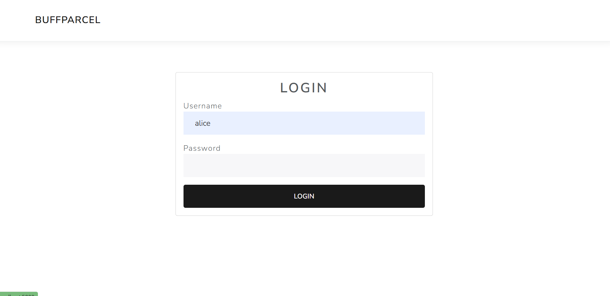
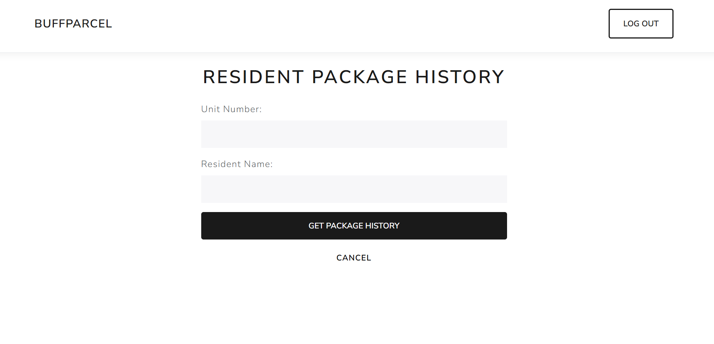
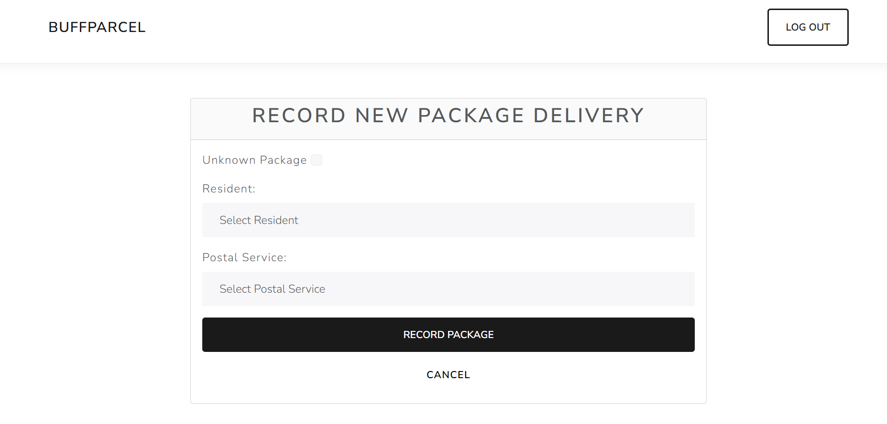
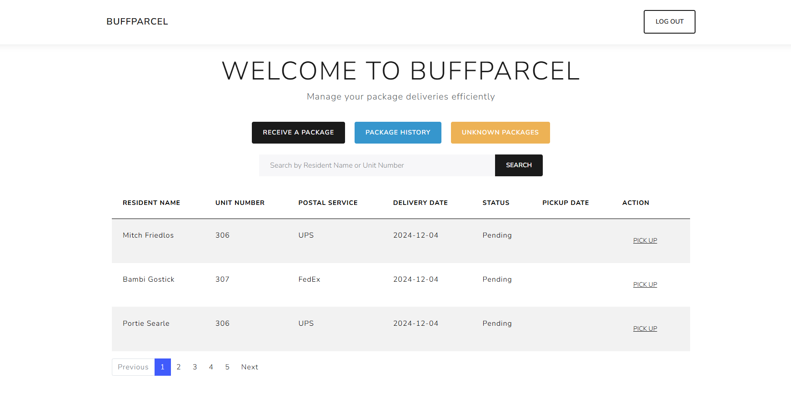

# BuffParcel

BuffParcel is a web application for managing package deliveries for residents. It allows users to record new package deliveries, view package history, and manage unknown packages.

## Table of Contents

- [Features](#features)
- [Installation](#installation)
- [Usage](#usage)

## Features

- Record new package deliveries
- View package history for residents
- Manage unknown packages
- User authentication and session management

## Installation

1. Clone the repository:
    ```sh
    git clone https://github.com/yourusername/BuffParcel.git
    cd BuffParcel
    ```

2. Install the required dependencies:
    ```sh
    dotnet restore
    ```

3. Create the initial migration:
    ```sh
    dotnet ef migrations add InitialCreate
    ```

4. Update the database:
    ```sh
    dotnet ef database update
    ```

5. Run the application:
    ```sh
    dotnet run
    ```

## Usage

1. Open your browser and navigate to `https://localhost:5001`.
2. Log in using the provided credentials.
3. Use the navigation links to record new package deliveries, view package history, and manage unknown packages.

<<<<<<< HEAD






=======


>>>>>>> 3876d9aa46a7a56c9af26f33550955341b48dc14
